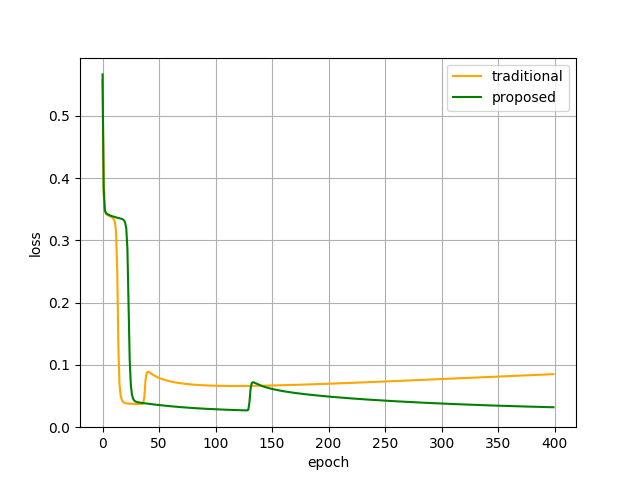
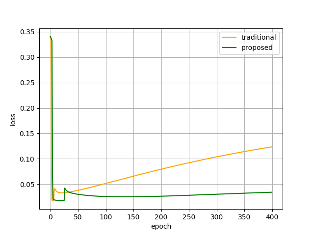
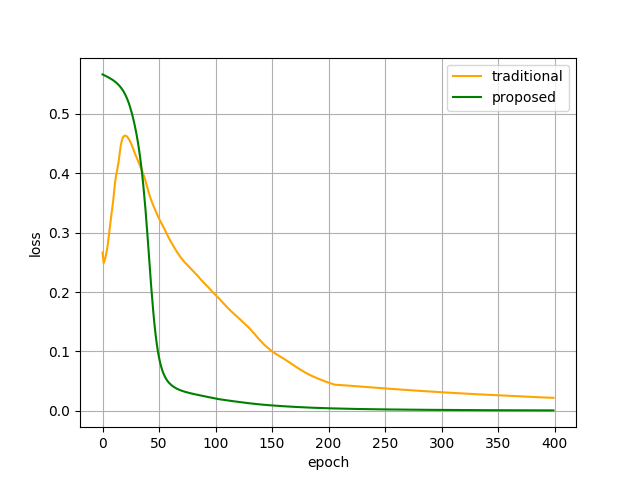
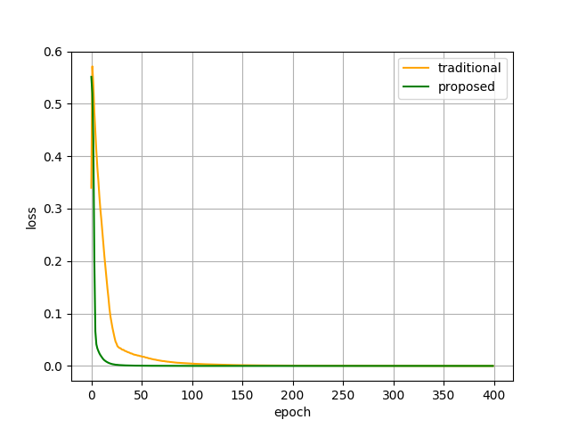
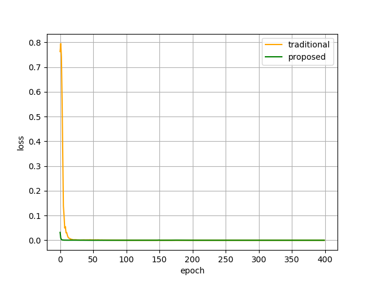
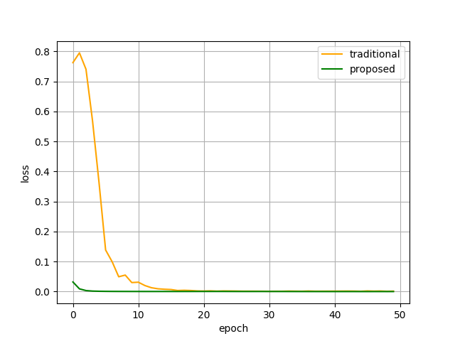
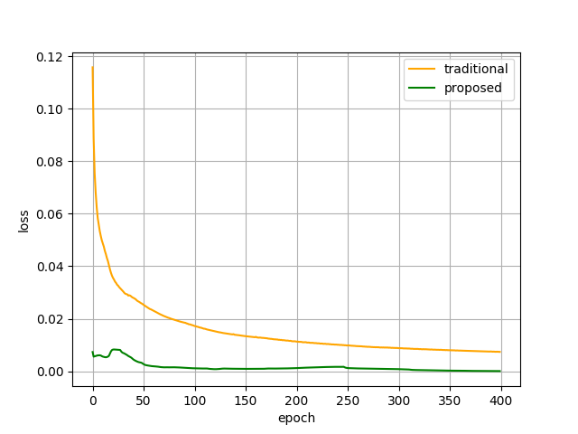
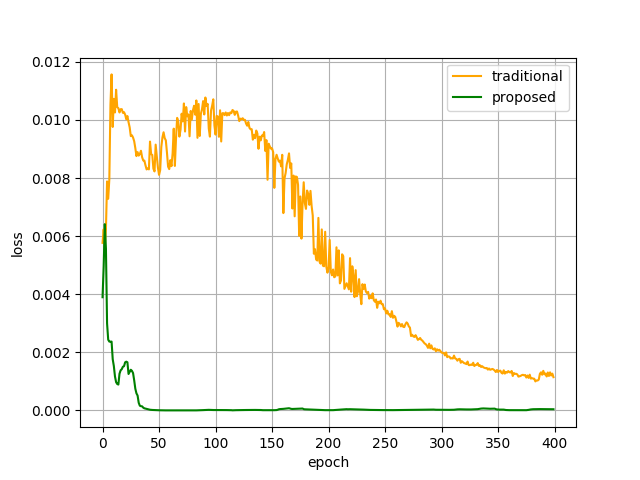
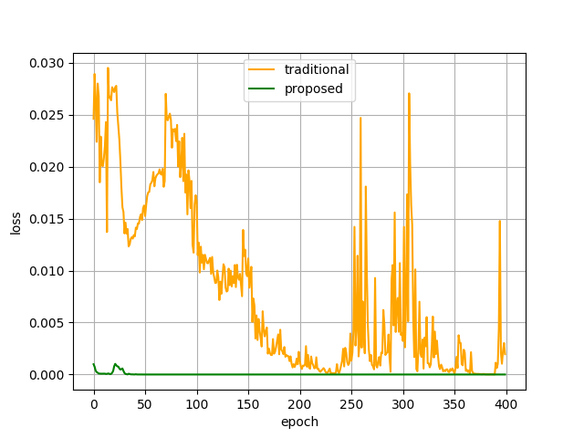

# Efficient Black Box Model Duplication with Dynamic Learning Rate

The following graphs shows the difference between loss functions of traditional and our proposed model duplication attacks.

**Classifier: Linear Regression, Dataset: Iris, Epochs: 400, Loss function: Mean Squared Error (MSE)**

*Learning rate: 0.01*



*Learning rate: 0.05*



**Classifier: Multi Layer Perceptron (MLP), Dataset: Liver disease, Epochs: 400, Loss function: Mean Squared Error (MSE)**

*Learning rate: 0.00001*



*Learning rate: 0.0001*



*Learning rate: 0.001*



Since both the lines converge closely at 400 epochs, lets visualize and analyze the graph after 50 epochs to see the results of the proposed approach.

*Learning rate: 0.001, epochs = 50*



**Classifier: Convolutional Neural Networks (CNNs) , Dataset: Land satellite disease, Epochs: 400, Loss function: Cross Entropy or Log Loss**

*Learning rate: 0.00001*



*Learning rate: 0.0001*



*Learning rate: 0.001*



# Installation
```
pip -r install requirements.txt
```

# Execution
To create the models
```
python PoC/<folder>/create_model.py
```

To steal the created models
```
python PoC/<folder>/steal_model.py
```

# Paper link 
TBD

# Authors
Nikhil Joshi, Rewanth Cool

# Conclusion
The above graphs or statistics clearly proves the ability of our proposed method to steal the black box machine learning models much more efficiently. Our proposed approach's loss function is much less fluctuating than the traditional approach.